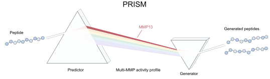
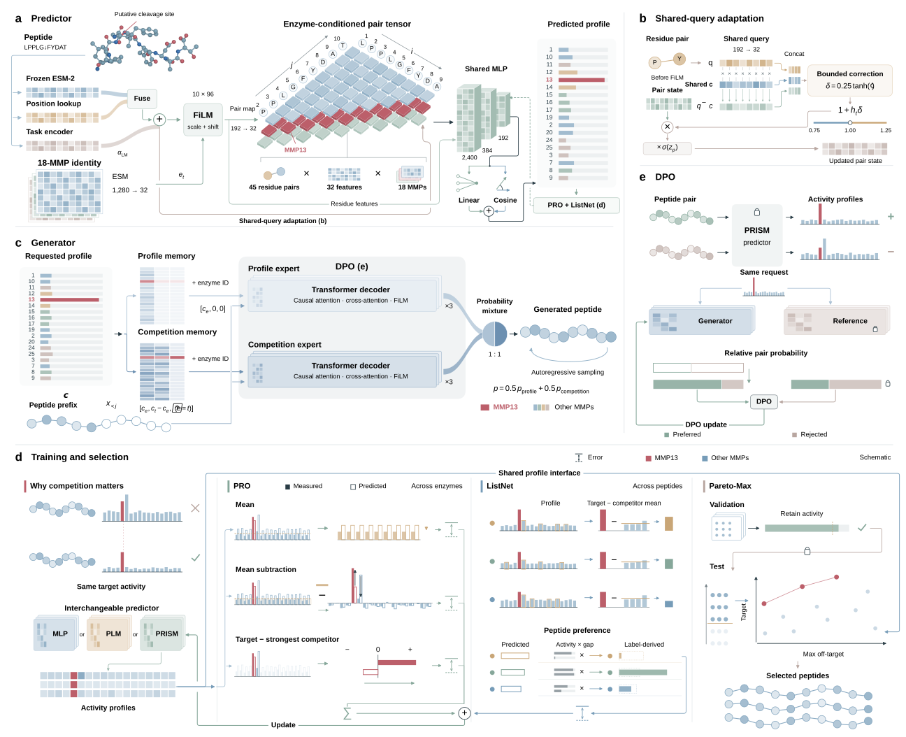

# PRISM

**Peptide Regression and Inverse design for Selective Metalloproteinase substrates**

PRISM is a deep learning framework for predicting peptide cleavage activity and designing substrates for matrix metalloproteinases (MMPs). It brings activity prediction and sequence generation into a single workflow, with a focus on identifying peptides that combine high predicted MMP13 activity with selectivity over the other 17 MMPs.

The **PRISM predictor** combines peptide language-model features with enzyme-conditioned modeling to estimate an 18-enzyme activity profile for each sequence. These profiles support candidate screening based on both target activity and competing enzyme activity.

The **PRISM generator** designs peptide sequences conditioned on requested activity profiles. It combines profile and competition experts with Pareto-DPO, using predictor-derived preferences to favor MMP13 activity and selectivity. Generated candidates can then be scored and ranked for experimental follow-up.

This repository provides pretrained predictor and generator weights, their training pipelines, and tools for peptide generation, prediction and evaluation.



## Table of contents

- [Getting started](#getting-started)
  - [Installation](#installation)
  - [Project structure](#project-structure)
  - [Check the installation](#check-the-installation)
- [Training models](#training-models)
  - [PRISM predictor](#prism-predictor)
  - [PRISM generator full training pipeline](#prism-generator-full-training-pipeline)
- [Predicting peptide activity](#predicting-peptide-activity)
- [Generating peptides](#generating-peptides)
  - [Generate and score](#generate-and-score)
  - [Single-checkpoint generation and evaluation](#single-checkpoint-generation-and-evaluation)
- [Run settings](#run-settings)
- [Data](#data)
  - [Predictor data](#predictor-data)
  - [Generator data](#generator-data)
- [Outputs](#outputs)

## Getting started

### Installation

Use Python 3.12. Run all commands from the repository root.

```sh
python3.12 -m venv .venv
source .venv/bin/activate
python -m pip install -r requirements/predictor.txt -r requirements/generator.txt
```

### Project structure

```text
PRISM/
├── predictor/                 # Activity prediction and training
│   ├── checkpoints/           # Released predictor weights (seeds 0, 1, 2)
│   ├── initialization/        # Pretrained task-LM weights and enzyme inputs
│   └── configs/               # Fixed predictor training settings
├── generator/                 # Peptide generation and full training pipeline
│   ├── checkpoints/           # Released generator weights (seeds 0, 1, 2)
│   ├── initialization/        # Supervised initialization for DPO
│   ├── configs/               # Generation and fixed training settings
│   └── data/                  # Fitting data, preference pairs and requested profiles
├── data/                      # Predictor training, validation, test and OOD data
├── evaluation/                # Prediction and generation evaluation scripts
├── requirements/              # Python dependencies
├── tests/                     # Model loading, prediction and training checks
├── assets/                    # Images used in this README
├── README.md                  # Installation, commands and data formats
└── run.sh                     # Training, prediction, generation and evaluation entry point
```

### Check the installation

```sh
bash run.sh verify
DEVICE=cpu bash run.sh smoke
```

The smoke check loads all three predictor and generator checkpoints and generates 50 attempts per generator.

## Training models

### PRISM predictor

```sh
# Train all three seeds:
DEVICE=cuda FEATURE_PRECISION=bf16 bash run.sh train-predictor
# One seed, or resume interrupted training:
SEEDS="0" DEVICE=cuda bash run.sh train-predictor
SEEDS="0" RESUME=1 DEVICE=cuda bash run.sh train-predictor
```

Training runs three stages: task-backbone training, pretrained task-LM integration, and shared-query adapter training. ESM features remain frozen. The task-LM initialization is included in `predictor/initialization/`; training settings are in `predictor/configs/prism.json`.

Models are saved to `outputs/predictor/training/seed{0,1,2}/final.pt`. Pass a new model to `predictor/predict.py --checkpoint` to use it for prediction.

### PRISM generator full training pipeline

```sh
# Train all three seeds:
DEVICE=cuda bash run.sh train-generator
# One seed, or resume interrupted training:
SEEDS="0" DEVICE=cuda bash run.sh train-generator
SEEDS="0" RESUME=1 DEVICE=cuda bash run.sh train-generator
```

The complete pipeline trains the base decoder, two conditional experts, and their mixture before Pareto-DPO:

| Stage | Training budget |
| --- | --- |
| Base decoder | 150 epochs from random initialization |
| Base refinement | 60 epochs |
| Profile and competition experts | 300 epochs each |
| Supervised mixture | 60 epochs |
| Pareto-DPO | 1,000 updates |

Training uses the packaged fitting data and prediction-derived preference pairs. Settings are in `generator/configs/training.json` and `generator/configs/pareto_dpo.json`.

Final models are saved to `outputs/generator/training/seed{0,1,2}/final.pt`. Pass a new model to `generator/sample.py --checkpoint` to generate peptides. Training commands save new weights separately; prediction and generation commands use the released checkpoints by default.

To run only DPO from the included supervised initialization:

```sh
DEVICE=cuda bash run.sh train-generator-dpo
```

DPO-only models are saved to `outputs/generator/dpo/seed{0,1,2}/last.pt`. Use `SEEDS` and `RESUME` as above to select seeds or resume training.

## Predicting peptide activity



```sh
DEVICE=cuda FEATURE_PRECISION=bf16 bash run.sh predictor
# CPU:
# DEVICE=cpu FEATURE_PRECISION=fp32 bash run.sh predictor
```

This evaluates validation, benchmark test and OOD sequences with seeds 0, 1 and 2. ESM-2 650M is downloaded on first use; extracted features are cached in `outputs/features/`.

For custom ten-residue sequences, provide a CSV with a `sequence` column:

```sh
python predictor/extract_features.py --input peptides.csv --output features.npz --device cuda --precision bf16
python predictor/predict.py --checkpoint predictor/checkpoints/seed0.pt \
  --input features.npz --output predictions.npz --device cuda
```

The output NPZ contains the input sequences, enzyme names and an N × 18 array of predicted activities.

## Generating peptides

### Generate and score

```sh
DEVICE=cuda bash run.sh generator
DEVICE=cuda bash run.sh score-generated
```

Generation uses 50 packaged MMP13 profiles, 400 attempts per profile and two sampling repeats for each checkpoint. Scoring uses the three PRISM predictors and exports predicted activity profiles and selected candidates.

```sh
# Unconditional generation:
MODE=unconditional TEMPERATURE=1.0 bash run.sh generator
# A single checkpoint and a custom output directory:
SEEDS="0" OUTPUT_DIR="$PWD/my_results" bash run.sh generator
```

### Single-checkpoint generation and evaluation

```sh
# Generate 50 attempts with one checkpoint on CPU:
python generator/sample.py --checkpoint generator/checkpoints/seed0.pt \
  --device cpu --per-template 1 --output outputs/example.csv
python generator/evaluate_checkpoint.py --checkpoint generator/checkpoints/seed0.pt \
  --device cuda --output outputs/development_nll.json
```

Sampling temperature defaults to 1.2 for conditional generation and 1.0 for unconditional generation. Generated sequences are saved as CSV files. Scoring exports predicted activity profiles and ranked Top24/Top100 MMP13 candidates.

Use each script’s `--help` for additional options.

## Run settings

| Variable | Default | Use |
| --- | --- | --- |
| `DEVICE` | `cuda` | `cuda` or `cpu` |
| `FEATURE_PRECISION` | `bf16` | Use `fp32` for CPU feature extraction |
| `SEEDS` | `0 1 2` | Checkpoints to run |
| `MODE` | `selective` | `selective` or `unconditional` |
| `TEMPERATURE` | `1.2` / `1.0` | Conditional / unconditional sampling |
| `PER_TEMPLATE` | `400` | Attempts per profile |
| `SAMPLING_SEEDS` | `2026111201 2026111202` | Sampling repeats |
| `OUTPUT_DIR` | `outputs/` | Output directory |
| `FEATURE_DIR` | `$OUTPUT_DIR/features/` | Feature cache |
| `POOL_DIR` | `$OUTPUT_DIR/generator/pools/` | Generated pools to score |
| `RESUME` | `0` | Set `1` to resume predictor or generator training |
| `PREDICTOR_LM_INIT` | `predictor/initialization/lmw_256_8_iso.pt` | Task-LM initialization |

`PYTORCH_PYTHON`, `GENERATOR_PYTHON` and `METRICS_PYTHON` can select separate Python executables. Run `bash run.sh help` for available commands.

## Data

### Predictor data

| Split | Peptides | Measured enzymes | Files |
| --- | ---: | ---: | --- |
| Training | 13,666 | 18 | `data/benchmark/train.csv`, `train.npz` |
| Validation | 1,200 | 18 | `data/benchmark/val.csv`, `val.npz` |
| Benchmark test | 2,901 | 18 | `data/benchmark/test.csv`, `test.npz` |
| OOD | 80 | 12 | `data/ood/ood.csv`, `ood.npz` |

Benchmark CSVs contain `sequence` followed by 18 activity columns. The matching NPZ files contain sequences, measured labels, rounded conditions and tokens. Split membership and enzyme orders are provided in `data/split_ids.json` and each dataset’s `target_order.json`.

Benchmark data use cleavage Z-scores; OOD data use published experimental efficiencies. OOD evaluation uses thresholds derived from those measurements. Data sources and preprocessing are documented in `data/source_manifest.json`.

### Generator data

| File under `generator/data/` | Contents |
| --- | --- |
| `fit.npz` | 10,954 fitting peptides with sequences, tokens, measured labels and rounded conditions |
| `development.npz` | 1,434 peptides for development loss evaluation |
| `preferences.csv` | 6,400 pairs: 5,101 training and 1,299 validation |
| `requests.json` | Requested 18-enzyme profiles, keyed by `fit_condition_index` |
| `templates.json` | 50 generation profiles and their fitting sequences, in sampling order |
| `known_sequences.txt` | 31,383 sequences excluded when counting novel outputs |
| `target_order.json` | Enzyme order; MMP13 has zero-based index 4 |

Generator conditions use 18-enzyme Z-score profiles rounded to 0.1. Preference pairs are scored by PRISM. `known_sequences.txt` is used to exclude known sequences when reporting novelty.

## Outputs

| Location under `OUTPUT_DIR` | Contents |
| --- | --- |
| `predictor/predictions/` | NPZ files containing sequences, enzyme order and predictions |
| `predictor/metrics/` | Aggregate/per-target metrics, selected peptides and thresholds |
| `predictor/training/seed*/` | Newly trained predictor, per-stage checkpoints and histories |
| `generator/nll/` | Generator development loss |
| `generator/pools/` | Raw generated sequences |
| `generator/quality/` | Sequence-quality summaries |
| `generator/prism_scores/` | Predicted activity profiles, scores and selected peptides |
| `generator/training/seed*/` | Complete generator training: stage checkpoints, histories and final model |
| `generator/dpo/seed*/` | Checkpoints from DPO training with the supplied initialization |
