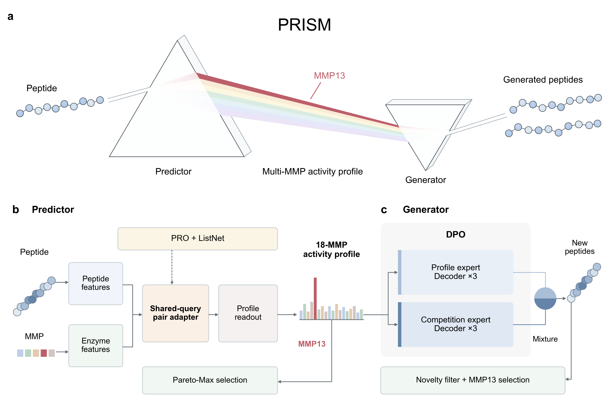
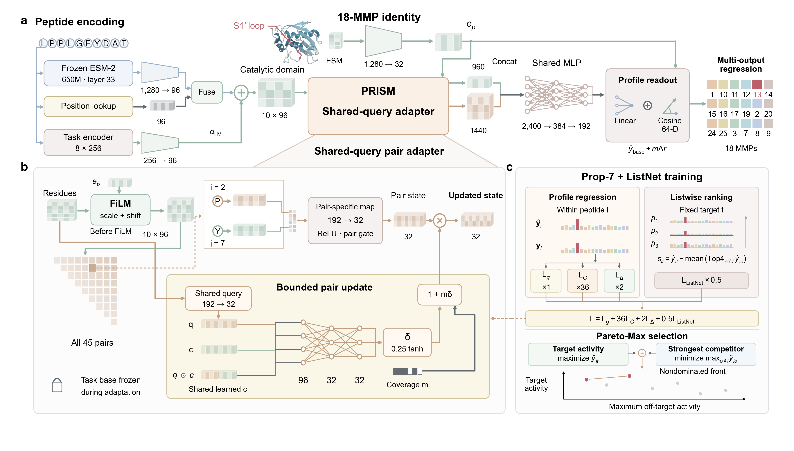

# PRISM

**Peptide Regression and Inverse design for Selective Metalloproteinase substrates**

PRISM predicts peptide activity across 18 MMPs and generates candidate substrates targeting MMP13.



## Installation

Use Python 3.12. Run all commands from the repository root.

```sh
python3.12 -m venv .venv
source .venv/bin/activate
python -m pip install -r requirements/predictor.txt -r requirements/generator.txt
```

## Run

### Check the data and checkpoints

```sh
bash run.sh verify
DEVICE=cpu bash run.sh smoke
```

The smoke check loads all three predictor and generator checkpoints and generates 50 attempts per generator.

### Predict and evaluate



```sh
DEVICE=cuda FEATURE_PRECISION=bf16 bash run.sh predictor
# CPU:
# DEVICE=cpu FEATURE_PRECISION=fp32 bash run.sh predictor
```

This evaluates validation, benchmark test and OOD sequences with seeds 0, 1 and 2. ESM-2 650M is downloaded on first use; extracted features are cached in `outputs/features/`.

The released predictor checkpoints are the original `prop7_listnet_batch / shared_query` models with three-seed mean benchmark Precision **7.0926%** under Count/Pareto-Max (Top100 per target, averaged over 18 targets). This is not MMP13-only precision. Checkpoint hashes are in `predictor/configs/prism.json`.

For custom ten-residue sequences, provide a CSV with a `sequence` column:

```sh
python predictor/extract_features.py --input peptides.csv --output features.npz --device cuda --precision bf16
python predictor/predict.py --checkpoint checkpoints/predictor/seed0.pt \
  --input features.npz --output predictions.npz --device cuda
```

The feature archive contains `sequences` and residue-level `esm33` features of shape N × 10 × 1280. Predictions contain `sequences`, `targets` and `predictions` of shape N × 18.

### Train the predictor

```sh
# All three seeds, original fixed recipe:
DEVICE=cuda FEATURE_PRECISION=bf16 bash run.sh train-predictor
# One seed, or resume interrupted training:
SEEDS="0" DEVICE=cuda bash run.sh train-predictor
SEEDS="0" RESUME=1 DEVICE=cuda bash run.sh train-predictor
```

This extracts training and validation features as needed and runs three stages:

1. Train the task backbone with frozen ESM features.
2. Add the original pretrained task LM as a residual branch; freeze inherited tensors for 10 epochs, then unfreeze them.
3. Freeze the selected backbone and train the shared-query adapter, including epoch zero in adapter checkpoint selection.

The fixed training loss is mean-activity MSE + 36 × centered-profile MSE + 2 × maximum-competitor-margin MSE + 0.5 × minibatch ListNet. Validation uses the first three terms only. Effective batch size is 128; each stage allows up to 300 epochs with patience 25. Training uses AdamW (learning rate 0.001, weight decay 0.001), cosine schedules, and adapter gradient clipping at 10. No ablation or loss-search options are exposed.

Task layers are initialized afresh; ESM is frozen and the task LM uses `predictor/initialization/lmw_256_8_iso.pt`. The packaged fixed inputs contain enzyme descriptors and the sequence-adapter masks/buffers, not trained task-layer parameters. Initialization hashes are checked before training. This command does not pretrain ESM or the task LM from random weights. It never reads benchmark test or OOD labels.

New models are written to `outputs/predictor/training/seed{0,1,2}/final.pt`, with per-stage best/resume checkpoints and training histories. Published checkpoints are not overwritten. To use a newly trained model, pass its `final.pt` to `predictor/predict.py`.

```sh
# Equivalent single-seed entry point; features must already exist:
python predictor/train.py --seed 0 --device cuda --features outputs/features \
  --output outputs/predictor/training/seed0
python predictor/train.py --seed 0 --device cuda --features outputs/features \
  --output outputs/predictor/training/seed0 --resume
```

Training follows the archived 7.09% recipe. Exact historical weights, early-stopping epochs and the reported score are not guaranteed by retraining. CUDA FP32 task training with historical BF16 ESM feature extraction is the reference setup; CPU/FP32 feature extraction is supported but changes the numerical setting. Recomputed features need not be byte-identical to the historical cache.

### Generate and score peptides

```sh
DEVICE=cuda bash run.sh generator
DEVICE=cuda bash run.sh score-generated
```

Generation uses 50 packaged MMP13 profiles, 400 attempts per profile and two sampling repeats for each checkpoint. Scoring uses the three PRISM predictors and exports predicted activity profiles and selected candidates.

```sh
# Unconditional generation:
MODE=unconditional TEMPERATURE=1.0 bash run.sh generator
# A single checkpoint and a custom output directory:
SEEDS="0" OUTPUT_DIR="$PWD/my_results" bash run.sh generator
```

### Train the generator

```sh
DEVICE=cuda bash run.sh train-generator
```

Runs 1,000 DPO updates from the packaged G1 initialization weights; it does not rebuild G1 from scratch. Only the original DPO parameter subset is updated, with no best-epoch selection. Preferences come from frozen PRISM predictions, not wet-lab measurements. New checkpoints go to `outputs/generator/dpo/seed{0,1,2}/last.pt`.

```sh
SEEDS="0" DEVICE=cuda bash run.sh train-generator
SEEDS="0" RESUME=1 DEVICE=cuda bash run.sh train-generator
# Direct single-seed entry point:
python generator/train.py --seed 0 --device cuda --output outputs/generator/dpo/seed0
python generator/train.py --seed 0 --device cuda --output outputs/generator/dpo/seed0 --resume
```

### Single-checkpoint generation and evaluation

```sh
# Generate 50 attempts with one checkpoint on CPU:
python generator/sample.py --checkpoint generator/checkpoints/seed0.pt \
  --device cpu --per-template 1 --output outputs/example.csv
python generator/evaluate_checkpoint.py --checkpoint generator/checkpoints/seed0.pt \
  --device cuda --output outputs/development_nll.json
```

Sampling options include `--mode selective|unconditional`, `--temperature`, `--seed`, `--per-template` and `--batch` (default 512). The released settings use CUDA FP32, batch 512, canonical log-softmax two-draw sampling, conditional temperature 1.2 and unconditional temperature 1.0. There is no forced STOP, length correction or refill. Settings are in `generator/configs/pareto_dpo.json`.

Output CSVs retain every attempt. `sequence` contains the generated string; `stopped_normally`, `raw_length` and `filter_reason` record its status. `condition_train_index` identifies the fitting sequence supplying the requested profile, or is -1 for unconditional generation. Scoring exports activity profiles and active-bottleneck Top24/100 candidates; predicted qualification is not experimental cleavage validation.

### Settings

| Variable | Default | Use |
| --- | --- | --- |
| `DEVICE` | `cuda` | `cuda` or `cpu` |
| `FEATURE_PRECISION` | `bf16` | Use `fp32` for CPU feature extraction |
| `SEEDS` | `0 1 2` | Checkpoints to run |
| `MODE` | `selective` | `selective` or `unconditional` |
| `TEMPERATURE` | `1.2` / `1.0` | Conditional / unconditional sampling |
| `PER_TEMPLATE` | `400` | Attempts per profile |
| `SAMPLING_SEEDS` | `2026111201 2026111202` | Sampling repeats |
| `OUTPUT_DIR` | `outputs/` | Output directory |
| `FEATURE_DIR` | `$OUTPUT_DIR/features/` | Feature cache |
| `POOL_DIR` | `$OUTPUT_DIR/generator/pools/` | Generated pools to score |
| `RESUME` | `0` | Set `1` to resume predictor or generator training |
| `PREDICTOR_LM_INIT` | `predictor/initialization/lmw_256_8_iso.pt` | Original task-LM initialization; SHA checked |

`PYTORCH_PYTHON`, `GENERATOR_PYTHON` and `METRICS_PYTHON` can select separate Python executables. Run `bash run.sh help` for available commands.

## Files

| Location | Contents |
| --- | --- |
| `checkpoints/predictor/seed{0,1,2}.pt` | Predictor weights |
| `predictor/train.py`, `predictor/losses.py` | Fixed three-stage predictor training |
| `predictor/configs/prism.json` | Predictor model, training and initialization settings |
| `predictor/initialization/` | Original task-LM initialization and fixed enzyme inputs |
| `generator/checkpoints/seed{0,1,2}.pt` | Generator weights |
| `generator/initialization/seed{0,1,2}.pt` | Generator initialization for DPO |
| `data/benchmark/` | Predictor training, validation and test data |
| `data/ood/` | Labelled OOD evaluation data |
| `generator/data/` | Generator fitting data, preferences and generation profiles |
| `generator/configs/pareto_dpo.json` | Generator settings |
| `predictor/`, `generator/`, `evaluation/` | Model and evaluation code |
| `requirements/`, `tests/`, `assets/` | Dependencies, checkpoint checks and figures |

### Predictor data

| Split | Peptides | Measured enzymes | Files |
| --- | ---: | ---: | --- |
| Training | 13,666 | 18 | `data/benchmark/train.csv`, `train.npz` |
| Validation | 1,200 | 18 | `data/benchmark/val.csv`, `val.npz` |
| Benchmark test | 2,901 | 18 | `data/benchmark/test.csv`, `test.npz` |
| OOD | 80 | 12 | `data/ood/ood.csv`, `ood.npz` |

The four splits have no exact sequence overlap; membership is in `data/split_ids.json`. Benchmark CSVs contain `sequence` followed by the 18 activity columns. NPZ arrays are `sequences` (N), `labels` (N × 18 cleavage Z-scores), `conditions` (N × 18 rounded to 0.1 for generation) and `tokens` (N × 10). Predictor training uses unrounded `labels`.

OOD NPZs contain `sequences`, `labels` (80 × 12 published efficiencies), `targets`, `substrate_ids` and `raw_fold_mean`. Benchmark Z-scores and OOD efficiencies have different units. The current OOD evaluation is retrospective: its qualification thresholds are computed from the external measurements under the fixed evaluation rule.

Enzyme orders are in `data/benchmark/target_order.json` and `data/ood/target_order.json`. Benchmark measurements originate from Kukreja et al., distributed with CleaveNet; OOD measurements come from published CleaveNet experiments. Source links and preprocessing metadata are in `data/source_manifest.json`.

### Generator data

| File under `generator/data/` | Contents |
| --- | --- |
| `fit.npz` | 10,954 fitting peptides with sequences, tokens, measured labels and rounded conditions |
| `development.npz` | 1,434 peptides for development loss evaluation |
| `preferences.csv` | 6,400 pairs: 5,101 training and 1,299 validation |
| `requests.json` | Requested 18-enzyme profiles, keyed by `fit_condition_index` |
| `templates.json` | 50 generation profiles and their fitting sequences, in sampling order |
| `known_sequences.txt` | 31,383 sequences excluded when counting novel outputs |
| `target_order.json` | Enzyme order; MMP13 has zero-based index 4 |

Profiles use the source Z-score scale, with conditions rounded to 0.1. Token order is `ACDEFGHIKLMNPQRSTVWY` (0–19); generator START = 20 and STOP = 21. Preference columns `delta_activity`, `delta_mean17` and `delta_max17` contain differences in PRISM predictions. The novelty exclusion file contains public dataset sequences and both members of the preference pairs.

### Outputs

| Location under `OUTPUT_DIR` | Contents |
| --- | --- |
| `predictor/predictions/` | NPZ files containing sequences, enzyme order and predictions |
| `predictor/metrics/` | Aggregate/per-target metrics, selected peptides and thresholds |
| `predictor/training/seed*/` | Newly trained predictor, per-stage checkpoints and histories |
| `generator/nll/` | Generator development loss |
| `generator/pools/` | Raw generated sequences |
| `generator/quality/` | Sequence-quality summaries |
| `generator/prism_scores/` | Predicted activity profiles, scores and selected peptides |
| `generator/dpo/` | New generator training checkpoints |
